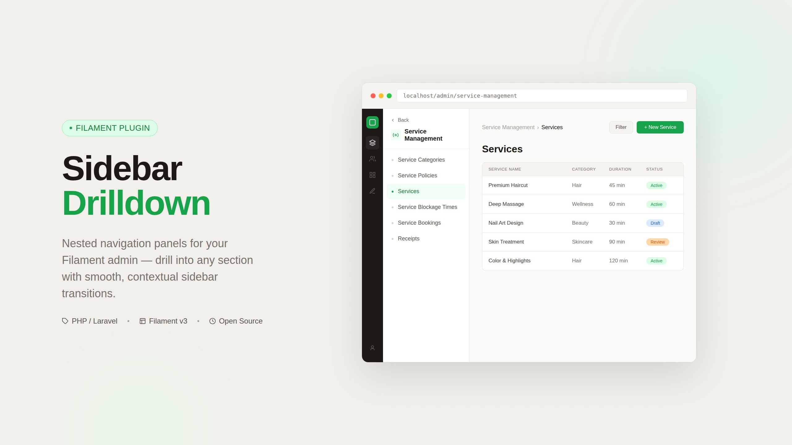

# Filament Drilldown Sidebar

A [Filament](https://filamentphp.com) plugin that adds optional drill-down navigation to sidebar groups. Instead of the default collapsible accordion, selected groups display as clickable buttons that slide into a detail view showing the group's items.

Groups not marked for drill-down keep the standard Filament collapsible behavior. Both styles can coexist in the same sidebar, rendered in their original registration order.

## Requirements

- PHP 8.1+
- Filament 3.x, 4.x, or 5.x
- Laravel 10, 11, or 12

## Version Compatibility

| Plugin Version | Filament | Laravel |
|---------------|----------|---------|
| 1.x           | 3.x, 4.x, 5.x | 10, 11, 12 |

> **Note:** In Filament v4+, the sidebar became a Livewire component. The published view override still works, but you should re-publish the views after upgrading Filament to a new major version:
> ```bash
> php artisan vendor:publish --tag=drilldown-sidebar-views --force
> ```

## Installation

```bash
composer require osamaatef/filament-drilldown-sidebar
```

Publish the sidebar view:

```bash
php artisan vendor:publish --tag=drilldown-sidebar-views
```

## Usage

Register the plugin in your panel provider and pass the labels of the groups that should use drill-down navigation:

```php
use OsamaAtef\DrilldownSidebar\DrilldownSidebarPlugin;

public function panel(Panel $panel): Panel
{
    return $panel
        ->plugins([
            DrilldownSidebarPlugin::make()
                ->drilledGroups([
                    'Service Management',
                    'Content Management',
                ]),
        ]);
}
```

Groups listed in `drilledGroups()` will render as a button with a chevron. Clicking it slides into a detail view with the group's items and a back button. All other groups render as the standard Filament collapsible accordion.

## How It Works

- **Main view**: Ungrouped items (Dashboard, etc.) appear first, followed by all labeled groups in their original registration order. Drilled groups show as buttons; standard groups show as collapsible accordions.
- **Detail view**: Clicking a drilled group slides in a panel showing the group title, icon, and its navigation items. A back button returns to the main view.
- **Collapsed sidebar**: When the sidebar is collapsed (icon-only mode), all groups use Filament's default icon dropdown regardless of drill-down status.
- **Auto-drill**: If the current page belongs to a drilled group, the sidebar automatically opens that group's detail view on page load.

## Screenshot



## License

MIT License. See [LICENSE](LICENSE) for details.
